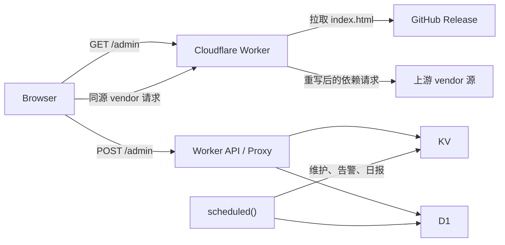

# 运行时架构

## 范围

本文负责 Worker 壳、路由职责、运行时绑定、资源代理和缓存语义。管理台内部结构见 [管理台契约](admin-console.md)，发布资产和 URL 推导见 [构建与发布](release.md)。

根 [worker.md](../worker.md) 中的核心约束优先于本文。

## 拓扑



`scheduled()` 不参与前端资源刷新。

## 路由职责

| 路由 | 职责 |
| --- | --- |
| `GET /` | 返回静态说明页，不承载后台实时数据 |
| `GET ADMIN_PATH` | 返回管理台壳，从固定 GitHub Release 获取 `index.html` |
| `GET/HEAD ${ADMIN_PATH}/__warm` | 鉴权后显式预热管理台 HTML、vendor manifest 与可缓存 JS/CSS |
| `POST ADMIN_PATH/login` | 校验登录并签发 `auth_token` |
| `POST ADMIN_PATH` | 登录后的统一管理 API 入口 |
| `${ADMIN_PATH}/__release/<tag>/vendor/*` | Worker 同源 vendor 代理与缓存入口 |
| 节点代理中的 `/web`、`/web/**` | 固定返回 `404`，不访问节点上游 |
| 其他节点代理路径 | 保持现有 Emby API、WebSocket、图片、字幕和媒体流代理 |

### Emby Web 边界

- Web 端反代已删除。所有节点入口模式都把大小写不敏感的 `/web` 与 `/web/**` 视为禁用子树；编码分隔符、编码大小写和路径回退片段在判断前统一归一化。HTML、JS、CSS、图片及其他静态资源均在缓存读取和上游请求前返回 `404`。
- Playback relay 的可见路径与隐藏目标路径、同节点上游的 `30x` 目标都执行同一边界检查；即使初始请求不是 `/web`，relay 或重定向进入 `/web` 时也停止处理、释放已有上游响应并返回禁用响应。`__pb_abs` 播放回退不能把该 `404` 改写为 `307`，其他非 Web 同源重定向保持原行为。
- `/websocket`、`/webhooks`、`/web-api` 不是 `/web` 子树，继续按原有 API 或 WebSocket 代理规则处理。
- 历史 `backup=1` 参数与 `emby_web_bypass` Cookie 不再放行请求。Worker 仅继续从出站 Cookie 中剥离旧 Cookie，避免将内部遗留状态发送给 Emby。
- 禁用响应使用 `Cache-Control: no-store, max-age=0`，`HEAD` 保持空 body；该规则与管理台 `/admin` 的 Release 壳和 vendor 资源代理无关。

## Worker 壳

- `worker.js` 保留 API、鉴权、代理、KV/D1、日志、scheduled 和资源交付能力。
- `/admin` 默认只拉取并返回 Release 顶层 `index.html`，不再内嵌完整管理台。
- Worker 优先替换远端 HTML 中已有的 `#admin-bootstrap` JSON。只有远端壳缺少 bootstrap 或 loader 时才回退到注入模式。
- 远端壳只有在真实 inline script 中包含 `tailwind.config` 且不存在 `id="admin-tailwind-prelude"` 的 script 时，才在配置脚本前注入 `window.tailwind` 初始化；`data-id`、`data-src` 和其他属性值中的同名文本不参与判断。该定向变换用于兼容历史 Release，不对其他 HTML 执行通用兼容注入。
- Worker 把外部 JS/CSS URL 改写为同源 vendor 路径，浏览器不直接访问发布源或 vendor 源。
- Release 源首次加载失败且没有缓存时返回降级页；已有 stale HTML 时优先使用 stale 内容。
- 同一 isolate 内并发冷加载把缓存复查、一次 Release `index.html` 拉取及 HTML/manifest 提交合并为一个完整操作；`${ADMIN_PATH}/__warm` 可在登录后或运维探测中显式填充 HTML 与不可变 vendor 资源缓存。

## 前端运行时链

正式前端入口链是：

```text
frontend/admin-runtime.template.html
  + frontend/scripts/admin-runtime-enhancements.mjs
  -> frontend/scripts/sync-admin-runtime.mjs
  -> frontend/index.html
  -> Vite build
  -> frontend/dist/index.html
```

同步脚本以模板和显式 runtime enhancements 为两个构建输入，确定性组合后负责：

- 静态化 `admin-bootstrap` fallback。
- 清空 `__INIT_HEALTH_BANNER__`。
- 写入 `#app` 根节点。
- 在 `</head>` 前组合唯一一份管理台增强 style/script。
- 保留管理台模板的 style/script 顺序与运行时行为。

当前前端栈仍是 `Vite + Vue`。`frontend/vite.config.js` 保留 `manifest`、`sourcemap`、`cssCodeSplit` 和 `manualChunks` 配置，正式入口不挂载 `src/main.js`。

前端构建和本地代理通过 `import.meta.env` 使用以下 Vite 环境变量：

- `VITE_API_BASE_URL`
- `VITE_ADMIN_PATH`
- `VITE_FRONTEND_RELEASE_CHANNEL`
- `VITE_VENDOR_MODE`
- `VITE_DEV_PROXY_TARGET`

本地开发服务器按 `VITE_ADMIN_PATH` 把管理台请求代理到 Worker 目标地址。正式 Worker 壳使用的 `INDEX_URL` 及其推导规则见 [构建与发布](release.md)。

## Isolate 内存读缓存

- 模块级 `GLOBALS` 只承担单个 Worker isolate 内的尽力读优化；KV、D1 和 Cache API 仍是真相源。isolate 被回收或请求落到另一个 isolate/PoP 时允许重新加载，不能依赖这里的状态实现跨请求一致性。
- 运行配置使用 60 秒内存 TTL。同一缓存 namespace、同一失效代次的并发刷新通过 single-flight 合并；读取期只在内存中吸收旧字段，不向 KV 隐式写回，持久化由显式保存、恢复或 KV 整理负责。主配置写入成功后立即预填新缓存，较早启动的读取不得把旧值重新写回。
- 代理节点读取路径的正缓存使用 60 秒 TTL，确认不存在的节点使用 1 秒负缓存，二者共用 5000 条有界 LRU；同一节点、同一失效代次的并发冷读取通过 single-flight 合并。管理台严格节点读取不使用负缓存。播放路由热快照使用 24 小时 TTL 和 1000 条上限，并复用快照中的节点派生 revision。
- 节点 revision 使用 1 秒 TTL 并合并同一 isolate 内的并发 KV 读取。节点写入会失效或预填 revision 及关联节点/播放缓存；单节点失效只推进该节点的读取代次，不会中断其他节点正在进行的冷读取，因此热节点命中不再逐请求强制读取 KV，但跨 isolate 可见性仍受 KV 与该短 TTL 约束。
- 节点摘要、轻量索引和 revision meta 的读取—合并—提交在同一 isolate 内共用 mutation chain；重建操作把实体加载与索引提交作为一个完整操作，旧读取不能在较新提交后回填缓存或覆盖 KV。内容写入成功后才提交 meta，链内失败不会阻断后续 mutation。该顺序不提供跨 isolate 的强一致事务。

## 两层缓存

以下两层只描述浏览器与 Worker Cache API 的响应交付缓存，不包含上面的 isolate 内存读优化。

### 浏览器缓存

- 版本化 vendor 路径只有在上游引用也符合不可变规则时才使用 `Cache-Control: public, max-age=31536000, immutable`；可变上游引用始终优先执行下文的 no-store 例外。
- Release tag 变化时，vendor 路径随版本变化，避免旧资源串用。
- `/admin` HTML 使用协商缓存，结合 `ETag` 或 `Last-Modified`。

### Worker Cache API

- Worker 使用 `caches.default` 的独立缓存键保存入口 HTML。当前缓存键同时包含完整 bootstrap 哈希和显式 transform revision；任一输入变化都会生成新的表示身份。
- HTML 采用 Stale-While-Revalidate：先返回可用缓存，再通过请求上下文后台刷新。同一 Worker isolate 内，相同当前缓存键的并发读取/旧键迁移和后台重验证分别 single-flight，迁移与重验证写入再由该键的 mutation chain 排序；刷新失败时继续保留已返回的 stale 表示。该顺序保证不跨 Worker isolate 或 PoP。
- 热缓存命中的运行状态记录通过 `ctx.waitUntil()` 后台提交，不阻塞 HTML 响应；显式预热请求会等待本次 HTML 与 vendor 缓存写入完成后再返回结果。vendor 按远端 HTML 出现顺序、最多 3 路并发预热，避免无界子请求和内存峰值。
- 每次当前缓存键 miss 时只查找一次旧格式缓存键。命中的旧 stale HTML 先完成当前 bootstrap 与定向 Tailwind 兼容变换；获得写入权后再次读取当前键，只有仍为 miss 才写入迁移表示，若重验证已经写入则直接使用当前表示。当前键命中后不再读取旧键，旧缓存键也不再原地回写或参与后台更新。
- 上游返回 `304 Not Modified` 时沿用当前缓存表示的 `ETag`、`Last-Modified` 和上游验证器，只刷新缓存时间，不重复执行兼容变换或重算表示 ETag。
- 设置恢复页和远端壳错误页使用 `Cache-Control: no-store, max-age=0`，不写入 Cache API。
- 刷新由请求触发，不绑定 CRON。
- 浏览器缓存命中与 Worker Cache API 命中必须分别判断和验证。

### 可变上游引用

如果远端壳引用 jsDelivr GitHub 可变 ref，或 `/gh/<owner>/<repo>/...` URL 省略 `@ref`，Worker 仍需改写为同源 vendor 路径。响应使用 `Cache-Control: no-store, max-age=0`，并跳过 `caches.default` 的读取和写入。

7 到 40 位十六进制 Git commit hash 和完整语义化版本号按不可变引用处理。完整版本号必须包含 major、minor、patch，可带 `v` 前缀、预发布标识或构建标识。省略 ref、分支名、`latest`、`1.2`、`^1.2.3` 和其他 ref 按上述 no-store 策略处理。可变 ref 与不可变 Release tag 不得共用缓存策略。

## 运行时绑定

### 必需

- `ENI_KV`
- `ADMIN_PASS`
- `JWT_SECRET`

### 可选

- `DB`
- `ADMIN_PATH`
- `HOST`
- `LEGACY_HOST`
- `GITHUB_TOKEN`
- `INDEX_URL`

### 兼容旧命名

- `KV`
- `EMBY_KV`
- `EMBY_PROXY`
- `D1`
- `PROXY_LOGS`
- `GITHUB_API_TOKEN`

### 部署与 CI

- `CLOUDFLARE_ACCOUNT_ID`
- `CLOUDFLARE_API_TOKEN`

`INDEX_URL` 只在没有 Release tag 派生 URL 和已保存 `indexUrl` 时作为回退。`WORKER_SOURCE_URL` 不是 Worker 运行时环境变量，发布脚本中的同名参数见 [构建与发布](release.md)。

`wrangler.toml` 当前声明的绑定只有 `ENI_KV` 和 `DB`，并启用了 `enable_request_signal`。`cfAccountId`、`cfZoneId`、`cfApiToken`、`tgBotToken`、`tgChatId` 是保存到 KV 的后台设置项，不是 Worker 环境变量。
