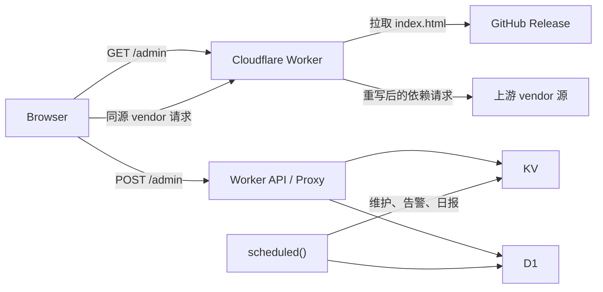

# 运行时架构

## 范围

本文负责 Worker 壳、路由职责、运行时绑定、资源代理和缓存语义。管理台内部结构见 [管理台契约](admin-console.md)，发布资产和 URL 推导见 [构建与发布](release.md)。

根 [worker.md](../worker.md) 中的核心约束优先于本文。

## 拓扑



`scheduled()` 不参与前端资源刷新。

## 路由职责

| 路由 | 职责 |
| --- | --- |
| `GET /` | 返回静态说明页，不承载后台实时数据 |
| `GET ADMIN_PATH` | 返回管理台壳，从固定 GitHub Release 获取 `index.html` |
| `GET/HEAD ${ADMIN_PATH}/__warm` | 鉴权后显式预热管理台 HTML、vendor manifest 与可缓存 JS/CSS |
| `POST ADMIN_PATH/login` | 校验登录并签发 `auth_token` |
| `POST ADMIN_PATH` | 登录后的统一管理 API 入口 |
| `${ADMIN_PATH}/__release/<tag>/vendor/*` | Worker 同源 vendor 代理与缓存入口 |
| 节点代理中的 `/web`、`/web/**` | 固定返回 `404`，不访问节点上游 |
| 其他节点代理路径 | 保持现有 Emby API、WebSocket、图片、字幕和媒体流代理 |

### 域名前缀节点 CNAME

- `host_prefix` 节点的对外记录名始终是 `<节点名>.<HOST>`；CNAME 目标只决定 DNS 记录内容，不改变节点访问域名或代理路由。
- CNAME 目标按“节点 `hostPrefixCnameTarget` > 全局 `defaultHostPrefixCnameTarget` > `HOST`”解析。节点字段留空表示继承全局值，全局字段留空表示回退到 `HOST`，因此旧配置保持原有行为。
- 两个配置字段在管理 API 边界统一规范化为小写主机名并移除末尾点；协议、端口、路径、通配符、空格和非法主机名不得进入内部配置或 DNS 同步计划。
- 新建、编辑、重命名、删除和导入节点时，DNS 同步计划必须显式携带旧、新 CNAME 目标；即使记录名不变，目标变化也必须更新记录。记录固定为 DNS-only：`ttl: 1`、`proxied: false`。
- 保存全局默认目标时，只同步未设置节点级覆盖的现有 `host_prefix` 节点；有节点级覆盖的记录保持不变。全局保存先完成全部校验并生成前向、回滚计划，再执行 DNS 更新，最后持久化配置。
- CNAME 与 A/AAAA 更新共用完整 host record 快照。任一步 DNS mutation、最终复读或关键 history 读写失败时，按快照恢复全部可编辑记录；history 写入前必须严格读取旧值，读取异常不得按空历史覆盖。单记录 `createDnsRecord` / `updateDnsRecord` 在 Cloudflare 写入后若 history 失败，也必须分别删除新记录或恢复旧记录，并返回补偿结果。
- 全局同步任一步失败时，补偿范围包含已完成计划和失败中的 active plan，且新配置不得生效；错误结果应指出失败节点和回滚状态。节点补偿分别尝试 DNS 与 KV 恢复，一个失败不得跳过另一个；完整导入跨阶段失败时先回滚节点，再恢复旧配置及其 DNS，节点计划的回滚目标必须按导入前配置解析。
- `hostPrefixCnameTarget` 属于节点实体、摘要索引、等价比较、导入导出和 KV 整理契约；它不改变上游代理行为，因此不进入代理缓存 revision。

### Emby Web 边界

- Web 端反代已删除。所有节点入口模式都把大小写不敏感的 `/web` 与 `/web/**` 视为禁用子树；编码分隔符、编码大小写和路径回退片段在判断前统一归一化。HTML、JS、CSS、图片及其他静态资源均在缓存读取和上游请求前返回 `404`。
- Playback relay 的可见路径与隐藏目标路径、同节点上游的 `30x` 目标都执行同一边界检查；即使初始请求不是 `/web`，relay 或重定向进入 `/web` 时也停止处理、释放已有上游响应并返回禁用响应。`__pb_abs` 播放回退不能把该 `404` 改写为 `307`，其他非 Web 同源重定向保持原行为。
- `/websocket`、`/webhooks`、`/web-api` 不是 `/web` 子树，继续按原有 API 或 WebSocket 代理规则处理。
- 历史 `backup=1` 参数与 `emby_web_bypass` Cookie 不再放行请求。Worker 仅继续从出站 Cookie 中剥离旧 Cookie，避免将内部遗留状态发送给 Emby。
- 禁用响应使用 `Cache-Control: no-store, max-age=0`，`HEAD` 保持空 body；该规则与管理台 `/admin` 的 Release 壳和 vendor 资源代理无关。

## Worker 壳

- `worker.js` 保留 API、鉴权、代理、KV/D1、日志、scheduled 和资源交付能力。
- `/admin` 默认只拉取并返回 Release 顶层 `index.html`，不再内嵌完整管理台。
- Worker 优先替换远端 HTML 中已有的 `#admin-bootstrap` JSON。只有远端壳缺少 bootstrap 或 loader 时才回退到注入模式。
- 远端壳只有在真实 inline script 中包含 `tailwind.config` 且不存在 `id="admin-tailwind-prelude"` 的 script 时，才在配置脚本前注入 `window.tailwind` 初始化；`data-id`、`data-src` 和其他属性值中的同名文本不参与判断。该定向变换用于兼容历史 Release，不对其他 HTML 执行通用兼容注入。
- Worker 按 HTML 标签语义识别并改写外部资源：`script[src]`、stylesheet/modulepreload，以及 `preload`/`prefetch` 中的 script/style；URL 是否带 `.js`/`.css` 后缀不影响识别。远端壳禁止 importmap 和任何 inline 动态 `import()`，浏览器不直接访问发布源或 vendor 源；禁止源和可变 ref 的判断必须先规范化绝对 URL，协议相对及尾点主机名写法不能绕过发布门禁。
- Release 源首次加载失败且没有缓存时返回降级页；已有 stale HTML 时优先使用 stale 内容。
- 同一 isolate 内并发冷加载把缓存复查、一次 Release `index.html` 拉取及 HTML/manifest 提交合并为一个完整操作；`${ADMIN_PATH}/__warm` 可在登录后或运维探测中显式填充 HTML 与不可变 vendor 资源缓存。

## 前端运行时链

正式前端入口链是：

```text
frontend/admin-runtime.template.html
  + frontend/scripts/admin-runtime-enhancements.mjs
  -> frontend/scripts/sync-admin-runtime.mjs
  -> frontend/index.html
  -> Vite build
  -> frontend/dist/index.html
```

同步脚本以模板和显式 runtime enhancements 为两个构建输入，确定性组合后负责：

- 静态化 `admin-bootstrap` fallback。
- 清空 `__INIT_HEALTH_BANNER__`。
- 写入 `#app` 根节点。
- 在 `</head>` 前组合唯一一份管理台增强 style/script。
- 保留管理台模板的 style/script 顺序与运行时行为。

当前前端栈仍是 `Vite + Vue`。`frontend/vite.config.js` 保留 `manifest`、`sourcemap`、`cssCodeSplit` 和 `manualChunks` 配置，正式入口不挂载 `src/main.js`。

前端构建和本地代理通过 `import.meta.env` 使用以下 Vite 环境变量：

- `VITE_API_BASE_URL`
- `VITE_ADMIN_PATH`
- `VITE_FRONTEND_RELEASE_CHANNEL`
- `VITE_VENDOR_MODE`
- `VITE_DEV_PROXY_TARGET`

本地开发服务器按 `VITE_ADMIN_PATH` 把管理台请求代理到 Worker 目标地址。正式 Worker 壳使用的 `INDEX_URL` 及其推导规则见 [构建与发布](release.md)。

## Isolate 内存读缓存

- 模块级 `GLOBALS` 只承担单个 Worker isolate 内的尽力读优化；KV、D1 和 Cache API 仍是真相源。isolate 被回收或请求落到另一个 isolate/PoP 时允许重新加载，不能依赖这里的状态实现跨请求一致性。
- 运行配置使用 60 秒内存 TTL。同一缓存 namespace、同一失效代次的并发刷新通过 single-flight 合并；读取期只在内存中吸收旧字段，不向 KV 隐式写回，持久化由显式保存、恢复或 KV 整理负责。主配置写入成功后立即预填新缓存，较早启动的读取不得把旧值重新写回。
- 代理节点读取路径的正缓存使用 60 秒 TTL，确认不存在的节点使用 1 秒负缓存，二者共用 5000 条有界 LRU；同一节点、同一失效代次的并发冷读取通过 single-flight 合并。管理台严格节点读取不使用负缓存。播放路由热快照使用 24 小时 TTL 和 1000 条上限，并复用快照中的节点派生 revision。
- PlaybackInfo 成功 JSON 使用同 isolate 的短期响应缓存，TTL 最长 60 秒、上限 500 条；缓存键覆盖节点派生 revision、请求方法/路径/查询/body、鉴权身份和重写模式。节点写入会清除对应条目，缓存响应不保留 `Set-Cookie` 或失效的实体校验头。
- 节点 revision 使用 1 秒 TTL 并合并同一 isolate 内的并发 KV 读取。节点写入会失效或预填 revision 及关联节点/播放缓存；单节点失效只推进该节点的读取代次，不会中断其他节点正在进行的冷读取，因此热节点命中不再逐请求强制读取 KV，但跨 isolate 可见性仍受 KV 与该短 TTL 约束。
- 节点摘要、轻量索引和 revision meta 的读取—合并—提交在同一 isolate 内共用 mutation chain；重建操作把实体加载与索引提交作为一个完整操作，旧读取不能在较新提交后回填缓存或覆盖 KV。内容写入成功后才提交 meta，链内失败不会阻断后续 mutation。该顺序不提供跨 isolate 的强一致事务。

## KV 写入与整理一致性

- KV 是运行配置、节点实体和配置快照的真相源。缺少 KV binding 时，`saveConfig`、`importSettings` 等持久化入口以 `KV_NOT_CONFIGURED`、HTTP `503` fail-closed；不得退化成仅在当前 isolate 生效的“临时成功”。
- 设置写入在单 isolate 内通过共享 mutation chain 串行，并把配置、配置 meta、设置快照、快照 meta 与遗留键删除作为一个条件补偿单元。完整导入、普通节点保存/导入、节点删除和主视频流快捷策略也从读取旧配置与节点起进入同一条链，直到索引提交、配置影子同步或失败补偿结束；后发配置或节点写入必须等待前序操作提交或回滚。KV 不提供事务，因此补偿前必须比较当前值与本操作的写入值；并发值已变化时保留新值并返回 `KV_MUTATION_ROLLBACK_CONFLICT`，不以旧快照覆盖它。
- 配置快照、默认 `exportSettings` 和默认 `exportConfig` 不持久化或下发 `cfApiToken`、`tgBotToken`。两个导出动作的显式含密钥模式分别使用匹配 action 名的敏感操作确认头；导入中缺少密钥字段表示沿用当前值，显式提供字段才允许覆盖或清空，快照恢复同样将当前密钥合并到目标配置后再保存。
- KV tidy 的 key list、配置、节点实体、节点索引与配置快照读取全部 fail-closed。分页只有在 `list_complete: true` 时视为完成；缺失/重复游标或 1000 页保护上限触发 `KV_SCAN_INCOMPLETE`，本轮不得写入。
- KV tidy 预览以现有 `JWT_SECRET` 对 scope、计划哈希、签发时间和过期时间签名。执行必须携带 `planToken`，在 tidy chain 与通用 KV mutation chain 内重新生成计划并校验哈希；令牌无效返回 `TIDY_PLAN_INVALID`，过期或数据变化返回 `TIDY_PLAN_STALE`，均为 HTTP `409`。
- 计划哈希覆盖扫描键集合、实际 put/delete mutation 内容、重建后的节点摘要，以及配置/快照的 revision 与内容摘要；这些输入任一变化都必须使旧令牌 stale。配额按前向 put/delete 与最坏补偿 put/delete 的总和计算。整理失败只补偿已完成的 mutation，并使用相同的当前值匹配规则；这些链只约束单 isolate，不承诺跨 isolate 强一致事务。

## 两层缓存

以下两层只描述浏览器与 Worker Cache API 的响应交付缓存，不包含上面的 isolate 内存读优化。

### 浏览器缓存

- 版本化 vendor 路径只有在上游引用也符合不可变规则时才使用 `Cache-Control: public, max-age=31536000, immutable`；可变上游引用始终优先执行下文的 no-store 例外。
- Release tag 变化时，vendor 路径随版本变化，避免旧资源串用。
- `/admin` HTML 使用协商缓存，结合 `ETag` 或 `Last-Modified`。
- 节点图片、静态文件和字幕只有在请求不携带媒体身份参数、鉴权头或业务 Cookie 时使用 `public`；携带身份时使用 `private`。manifest、媒体字节流、错误和重定向响应保持 `no-store`。

### Worker Cache API

- Worker 使用 `caches.default` 的独立缓存键保存入口 HTML。当前缓存键同时包含完整 bootstrap 哈希和显式 transform revision；任一输入变化都会生成新的表示身份。
- HTML 采用 Stale-While-Revalidate：先返回可用缓存，再通过请求上下文后台刷新。同一 Worker isolate 内，相同当前缓存键的并发读取/旧键迁移和后台重验证分别 single-flight，迁移与重验证写入再由该键的 mutation chain 排序；刷新失败时继续保留已返回的 stale 表示。该顺序保证不跨 Worker isolate 或 PoP。
- 热缓存命中的运行状态记录通过 `ctx.waitUntil()` 后台提交，不阻塞 HTML 响应；显式预热请求会等待本次 HTML 与 vendor 缓存写入完成后再返回结果。vendor 按远端 HTML 出现顺序、最多 3 路并发预热，避免无界子请求和内存峰值。
- 每次当前缓存键 miss 时只查找一次旧格式缓存键。命中的旧 stale HTML 先完成当前 bootstrap 与定向 Tailwind 兼容变换；获得写入权后再次读取当前键，只有仍为 miss 才写入迁移表示，若重验证已经写入则直接使用当前表示。当前键命中后不再读取旧键，旧缓存键也不再原地回写或参与后台更新。
- 上游返回 `304 Not Modified` 时沿用当前缓存表示的 `ETag`、`Last-Modified` 和上游验证器，只刷新缓存时间，不重复执行兼容变换或重算表示 ETag。
- 设置恢复页和远端壳错误页使用 `Cache-Control: no-store, max-age=0`，不写入 Cache API。
- 节点图片、字幕和白名单 manifest 使用独立 metadata 缓存键。键必须同时包含节点派生 revision、SHA-256 媒体身份分区、显式 metadata transform revision 和当前 TTL 策略 revision；原始 Token、Cookie、用户或会话值不得出现在缓存 URL。每个预热目标必须用目标 URL 的敏感 query 与请求鉴权 header/Cookie 单独计算身份分区，不能复用父 JSON 请求的分区。缺少身份或策略分区时跳过缓存，配置调低或关闭 TTL 会生成新键，不继续命中旧策略对象。
- metadata lookup 把 `Range`、`If-None-Match` 和 `If-Modified-Since` 传给 `cache.match()`，由 Cache API 返回对应 `206`/`304`；携带 `If-Range` 时绕过 Cache API 并交由上游完整处理。metadata 上游 `fetch()` 固定使用 `cache: no-store`，不得再叠加未按身份分区的 `cf.cacheEverything` 缓存。
- 刷新由请求触发，不绑定 CRON。
- 浏览器缓存命中与 Worker Cache API 命中必须分别判断和验证。

### 可变上游引用

如果远端壳引用 jsDelivr GitHub 可变 ref，或 `/gh/<owner>/<repo>/...` URL 省略 `@ref`，Worker 仍需改写为同源 vendor 路径。响应使用 `Cache-Control: no-store, max-age=0`，并跳过 `caches.default` 的读取和写入。

7 到 40 位十六进制 Git commit hash 和完整语义化版本号按不可变引用处理。完整版本号必须包含 major、minor、patch，可带 `v` 前缀、预发布标识或构建标识。省略 ref、分支名、`latest`、`1.2`、`^1.2.3` 和其他 ref 按上述 no-store 策略处理。可变 ref 与不可变 Release tag 不得共用缓存策略。

## 运行时绑定

### 必需

- `ENI_KV`
- `ADMIN_PASS`
- `JWT_SECRET`

### 可选

- `DB`
- `ADMIN_PATH`
- `HOST`
- `LEGACY_HOST`
- `GITHUB_TOKEN`
- `INDEX_URL`

### 兼容旧命名

- `KV`
- `EMBY_KV`
- `EMBY_PROXY`
- `D1`
- `PROXY_LOGS`
- `GITHUB_API_TOKEN`

### 部署与 CI

- `CLOUDFLARE_ACCOUNT_ID`
- `CLOUDFLARE_API_TOKEN`

`INDEX_URL` 只在没有 Release tag 派生 URL 和已保存 `indexUrl` 时作为回退。`WORKER_SOURCE_URL` 不是 Worker 运行时环境变量，发布脚本中的同名参数见 [构建与发布](release.md)。

`wrangler.toml` 当前声明的绑定只有 `ENI_KV` 和 `DB`，并启用了 `enable_request_signal`。`cfAccountId`、`cfZoneId`、`cfApiToken`、`tgBotToken`、`tgChatId` 是保存到 KV 的后台设置项，不是 Worker 环境变量。

## D1 schema

- 根 `migrations/` 是 D1 schema 的正式真相源，Wrangler 使用 `d1_migrations` 记录已应用版本。v5 升级链依次为新库基础表 `0001_d1_fresh_baseline.sql`、历史库兼容表 `0002_d1_historical_compatibility.sql` 和索引收口 `0003_d1_schema_v5_indexes.sql`。SQLite migration 不猜测任意旧表缺失列；历史库必须先由运行时兼容初始化确认并补齐 `category` 等列，再应用创建 `idx_proxy_logs_category_time` 的 v5 索引 migration；新库可直接顺序应用全部 migration。
- `worker.js` 保留运行时 `CREATE TABLE IF NOT EXISTS` 与逐列 `ALTER TABLE`，仅用于旧库兼容和首次启动兜底。`initD1Schema` 会先失效当前 binding 的初始化状态，再按运行时表、日志表和小时统计逐步执行；`PRAGMA table_info` 失败返回 `D1_SCHEMA_INSPECTION_FAILED`，不得按“零列”继续猜测结构。
- `initLogsDb` 只负责日志基础表、旧日志列、日志索引和小时统计，不依赖 DNS IP、鉴权或 Cloudflare cache 表就绪；`initLogsFts` 只在日志基础结构上重建派生 FTS。`proxy_logs_fts` 不进入基础 migration，FTS 创建或重建失败不得报告 `ftsReady: true`。
- `getD1SchemaStatus` 直接复检 `sqlite_master`、11 张运行时表的完整必需列、主键、`dns_ip_pool_items.ip` 唯一键、命名索引所属表与完整键列顺序，以及 `d1_migrations`；不以同名错误索引、partial index、夹带 expression key 的索引或此前初始化成功缓存代替结构检查。状态分别报告 `runtimeCompatibilityVersion`、`runtimeCompatibilityReady`、`appliedMigrations`、`latestRequiredMigration`、`missingMigrations`、`migrationReady`、`schemaVersion`、表/列/索引/约束/FTS readiness 与 `issues`。为兼容历史库，不把通用列类型、默认值、非空约束或索引升降序作为 readiness 门槛；仅 `proxy_logs.id` 要求 SQLite `INTEGER PRIMARY KEY` 语义。
- `runtimeCompatibilityReady` 只表示当前结构满足 Worker v5 兼容读取；`migrationReady` 还要求 `d1_migrations` 表有效且三个要求 migration 均已记录。只有二者条件满足时 `schemaVersion` 才返回 `5`，运行时兜底不得伪造正式 migration 版本。
- 日志、小时统计和 DNS IP 工作区初始化在同一 isolate、同一 D1 binding 上只缓存进行中的 single-flight，避免并发重复执行整套 DDL/PRAGMA；任务完成后释放缓存，后续初始化或显式状态检查会重新验证实际结构，避免 binding 漂移后永久误报 ready。
- 索引必须对应正式查询：日志保留时间游标、客户端 IP + 时间、状态 + 时间、分类 + 时间；DNS IP 项按更新时间与 IP 排序，探测缓存覆盖 `entry_colo + ip + expires_at` 批量读取；过期清理索引继续保留。
- 与复合主键或现有复合索引重复、且正式查询没有消费者的索引不属于基线，避免增加 D1 `rowsWritten` 和单库写队列压力。
- DNS IP 来源列表的全量替换必须把清空与新记录写入放在同一个 D1 batch 中；任一语句失败时不得提交空列表或部分列表。
