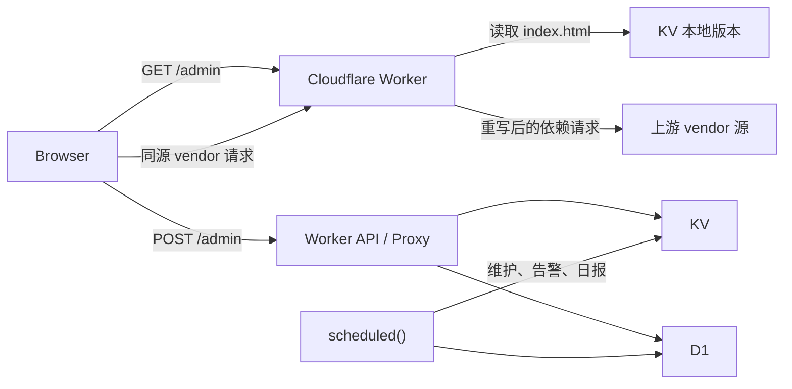

# 运行时架构

## 范围

本文负责 Worker 壳、路由职责、运行时绑定、资源代理和缓存语义。管理台内部结构见 [管理台契约](admin-console.md)，发布资产和 URL 推导见 [构建与发布](release.md)。

根 [worker.md](../worker.md) 中的核心约束优先于本文。

## 拓扑



`scheduled()` 不参与前端资源刷新。

## 路由职责

| 路由 | 职责 |
| --- | --- |
| `GET /` | 返回静态说明页，不承载后台实时数据 |
| `GET ADMIN_PATH` | 返回管理台壳，从 KV 内容寻址版本获取已上传的 `index.html` |
| `GET/HEAD ${ADMIN_PATH}/__warm` | 鉴权后显式预热管理台 HTML、vendor manifest 与可缓存 JS/CSS |
| `POST ADMIN_PATH/login` | 校验登录并签发 `auth_token` |
| `POST ADMIN_PATH` | 登录后的统一管理 API 入口 |
| `GET/HEAD ${ADMIN_PATH}/__server-record-poster/<node>` | 登录后按 D1 最近媒体指针以 TMDB、IMDb 经 TMDB Find、Emby 的固定顺序返回同源主海报，不向浏览器暴露节点 Token 或外部密钥 |
| `${ADMIN_PATH}` `uploadAdminIndex` | 登录后校验并保存本地 `index.html`，再切换当前壳来源 |
| `${ADMIN_PATH}` `updateWorkerAndAdminIndex` | 登录后同时校验并上传 `worker.js` 与 `index.html`，缺一不可；Worker 部署失败时补偿恢复旧 HTML 配置 |
| `${ADMIN_PATH}/__release/<local-revision>/vendor/*` | 已认证的 Worker 同源 vendor 代理与缓存入口；路径段沿用兼容命名，但只接受本地内容版本 |
| 节点代理中的 `/web`、`/web/**` | 固定返回 `404`，不访问节点上游 |
| 其他节点代理路径 | 保持现有 Emby API、WebSocket、图片、字幕和媒体流代理 |

### 域名前缀节点 CNAME

- `host_prefix` 节点的对外记录名始终是 `<节点名>.<HOST>`；CNAME 目标只决定 DNS 记录内容，不改变节点访问域名或代理路由。
- CNAME 目标按“节点 `hostPrefixCnameTarget` > 全局 `defaultHostPrefixCnameTarget` > `HOST`”解析。节点字段留空表示继承全局值，全局字段留空表示回退到 `HOST`，因此旧配置保持原有行为。
- 两个配置字段在管理 API 边界统一规范化为小写主机名并移除末尾点；协议、端口、路径、通配符、空格和非法主机名不得进入内部配置或 DNS 同步计划。
- 新建、编辑、重命名、删除和导入节点时，DNS 同步计划必须显式携带旧、新 CNAME 目标；即使记录名不变，目标变化也必须更新记录。记录固定为 DNS-only：`ttl: 1`、`proxied: false`。
- 保存全局默认目标时，只同步未设置节点级覆盖的现有 `host_prefix` 节点；有节点级覆盖的记录保持不变。全局保存先完成全部校验并生成前向、回滚计划，再执行 DNS 更新，最后持久化配置。
- CNAME 与 A/AAAA 更新共用完整 host record 快照。任一步 DNS mutation、最终复读或关键 history 读写失败时，按快照恢复全部可编辑记录；history 写入前必须严格读取旧值，读取异常不得按空历史覆盖。单记录 `createDnsRecord` / `updateDnsRecord` 在 Cloudflare 写入后若 history 失败，也必须分别删除新记录或恢复旧记录，并返回补偿结果。
- 全局同步任一步失败时，补偿范围包含已完成计划和失败中的 active plan，且新配置不得生效；错误结果应指出失败节点和回滚状态。节点补偿分别尝试 DNS 与 KV 恢复，一个失败不得跳过另一个；完整导入跨阶段失败时先回滚节点，再恢复旧配置及其 DNS，节点计划的回滚目标必须按导入前配置解析。
- `hostPrefixCnameTarget` 属于节点实体、摘要索引、等价比较、导入导出和 KV 整理契约；它不改变上游代理行为，因此不进入代理缓存 revision。

### Emby Web 边界

- Web 端反代已删除。所有节点入口模式都把大小写不敏感的 `/web` 与 `/web/**` 视为禁用子树；编码分隔符、编码大小写和路径回退片段在判断前统一归一化。HTML、JS、CSS、图片及其他静态资源均在缓存读取和上游请求前返回 `404`。
- Playback relay 的可见路径与隐藏目标路径、同节点上游的 `30x` 目标都执行同一边界检查；即使初始请求不是 `/web`，relay 或重定向进入 `/web` 时也停止处理、释放已有上游响应并返回禁用响应。`__pb_abs` 播放回退不能把该 `404` 改写为 `307`，其他非 Web 同源重定向保持原行为。
- `/websocket`、`/webhooks`、`/web-api` 不是 `/web` 子树，继续按原有 API 或 WebSocket 代理规则处理。
- 历史 `backup=1` 参数与 `emby_web_bypass` Cookie 不再放行请求。Worker 仅继续从出站 Cookie 中剥离旧 Cookie，避免将内部遗留状态发送给 Emby。
- 禁用响应使用 `Cache-Control: no-store, max-age=0`，`HEAD` 保持空 body；该规则与管理台 `/admin` 的 Release 壳和 vendor 资源代理无关。

### 节点探针

- 管理台节点健康检查与线路故障转移共用专用探针 URL 解析。节点目标自带子路径时，探针路径仅在以该子路径完整段开头时剥离一次重复前缀：例如目标 `https://origin/emby` 配合 `/emby/System/Ping` 实际请求 `/emby/System/Ping`；根路径节点和不匹配前缀保持原样。常规 API 与媒体代理仍使用原有 URL 拼接，不受此规则影响。
- 健康检查默认请求节点 HEAD 探针而不是节点根路径；只有最终 HTTP `200-299` 才返回正常延迟，其他状态、网络错误和超时均返回既有失败哨兵值。HEAD 收到 `405` 或 `501` 时释放响应体后以相同 URL 回退一次 GET；其他非 2xx 不回退。故障转移使用相同 URL 解析与 2xx 成功标准。

## Worker 壳

- `worker.js` 保留 API、鉴权、代理、KV/D1、日志、scheduled 和资源交付能力。
- `/admin` 只从 KV 读取内容寻址的本地 `index.html`；未上传时进入启动门，不再读取 Release、环境 `INDEX_URL` 或内嵌完整管理台。
- 本地上传版本保存为 `sys:admin_index_upload:v1:<sha256>`，配置中的 `indexUrl` 使用 `https://admin-local-index.invalid/<sha256>/index.html` 作为内部版本标识。该地址不会被浏览器直接请求。
- Worker 优先替换上传 HTML 中已有的 `#admin-bootstrap` JSON。只有壳缺少 bootstrap 或 loader 时才回退到注入模式。
- 上传 HTML 只有在真实 inline script 中包含 `tailwind.config` 且不存在 `id="admin-tailwind-prelude"` 的 script 时，才在配置脚本前注入 `window.tailwind` 初始化；`data-id`、`data-src` 和其他属性值中的同名文本不参与判断。
- Worker 按 HTML 标签语义识别并改写外部资源：`script[src]`、stylesheet/modulepreload，以及 `preload`/`prefetch` 中的 script/style；URL 是否带 `.js`/`.css` 后缀不影响识别。上传壳禁止 importmap 和任何 inline 动态 `import()`，浏览器不直接访问 vendor 源；禁止源和可变 ref 的判断必须先规范化绝对 URL，协议相对及尾点主机名写法不能绕过门禁。
- 本地版本首次加载失败且没有缓存时返回降级页；已有 stale HTML 时优先使用 stale 内容。
- 同一 isolate 内并发冷加载把缓存复查、一次源 HTML 读取及 HTML/manifest 提交合并为一个完整操作；`${ADMIN_PATH}/__warm` 可在登录后或运维探测中显式填充 HTML 与不可变 vendor 资源缓存。

## 前端运行时链

正式前端入口链是：

```text
frontend/admin-runtime.template.html
  + frontend/scripts/admin-runtime-enhancements.mjs
  -> frontend/scripts/sync-admin-runtime.mjs
  -> frontend/index.html
  -> Vite build
  -> frontend/dist/index.html
```

同步脚本以模板和显式 runtime enhancements 为两个构建输入，确定性组合后负责：

- 静态化 `admin-bootstrap` fallback。
- 清空 `__INIT_HEALTH_BANNER__`。
- 写入 `#app` 根节点。
- 在 `</head>` 前组合唯一一份管理台增强 style/script。
- 保留管理台模板的 style/script 顺序与运行时行为。

当前前端栈仍是 `Vite + Vue`。`frontend/vite.config.js` 保留 `manifest`、`sourcemap`、`cssCodeSplit` 和 `manualChunks` 配置，正式入口不挂载 `src/main.js`。

前端构建和本地代理通过 `import.meta.env` 使用以下 Vite 环境变量：

- `VITE_API_BASE_URL`
- `VITE_ADMIN_PATH`
- `VITE_FRONTEND_RELEASE_CHANNEL`
- `VITE_VENDOR_MODE`
- `VITE_DEV_PROXY_TARGET`

本地开发服务器按 `VITE_ADMIN_PATH` 把管理台请求代理到 Worker 目标地址。正式 Worker 壳只使用 KV 中的本地 HTML 内容版本；Release 资产与发布校验见 [构建与发布](release.md)。

## Isolate 内存读缓存

- 模块级 `GLOBALS` 只承担单个 Worker isolate 内的尽力读优化；KV、D1 和 Cache API 仍是真相源。isolate 被回收或请求落到另一个 isolate/PoP 时允许重新加载，不能依赖这里的状态实现跨请求一致性。
- 运行配置使用 60 秒内存 TTL。同一缓存 namespace、同一失效代次的并发刷新通过 single-flight 合并；读取期只在内存中吸收旧字段，不向 KV 隐式写回，持久化由显式保存、恢复或 KV 整理负责。主配置写入成功后立即预填新缓存，较早启动的读取不得把旧值重新写回。
- 代理 CORS、IP 黑名单和地域 allow/block 规则按运行配置对象派生一个 `WeakMap` profile；原始规则字符串变化时 profile 自动失效，热请求复用已去重的 `Set`，不在每次请求中重复 `split/map/filter`。
- 代理节点读取路径的正缓存使用 60 秒 TTL，确认不存在的节点使用 1 秒负缓存，二者共用 512 条有界 LRU；同一节点、同一失效代次的并发冷读取通过 single-flight 合并。管理台严格节点读取不使用负缓存。播放路由热快照使用 24 小时 TTL 和 256 条上限，并复用快照中的节点派生 revision。
- PlaybackInfo 成功 JSON 使用同 isolate 的短期响应缓存，TTL 最长 60 秒、最多 64 条；单条响应体最多 256 KiB，所有条目的响应体合计最多 4 MiB，超过任一预算时不缓存或按 LRU 淘汰。重写路径只物化一次有界 body，后续缓存写入复用该快照，不重复 `clone()`/读取。缓存键覆盖节点派生 revision、请求方法/路径/查询/body、鉴权身份、重写模式、聚合策略 revision 和池内全部节点的 `cacheRevision`。存在后台聚合任务，或认证、网络、超时、响应超限、非法 JSON 等节点失败时，部分响应不进入 60 秒缓存；节点或策略变化会使旧键立即不可命中。缓存响应不保留 `Set-Cookie` 或失效的实体校验头。
- 影视资源版本聚合使用配置中的 `mediaAggregationNodes` 组成节点池。请求任一池内节点的 `PlaybackInfo` 时，Worker 解析 `Type`、ProviderIds、标题/原始标题、年份及 Episode 的 Series/季集身份，再按 TMDB、IMDb、严格标题年份顺序匹配。任何双方共有的强 ID 冲突都会拒绝合并；标题兜底只接受同类型、规范化标题和年份完全一致。Episode 优先匹配所属 Series 强 ID，否则匹配 Series 标题年份，并要求季号、集号及可选结束集号完全一致。`mediaAggregationMatchMode: strict` 可关闭标题年份兜底。
- 备服凭据按“节点 `mediaAggregationEmbyUsername` / `mediaAggregationEmbyPassword` > 全局同名字段”解析，账号存在即有效且密码允许为空。每个节点按活动线路优先顺序逐条登录和查询；认证缓存按节点 revision、目标线路、API 前缀和凭据摘要分区。网络错误、超时及 408/425/429/5xx 会继续下一线路，单个备服失败不改变主服 PlaybackInfo。`AnyProviderIdEquals` 不受支持时改用 `SearchTerm` 取候选，并继续在 Worker 内执行相同的严格复核。
- 聚合最多并发请求 8 个备服。默认等待首个有效备服结果最多 `mediaAggregationFirstResultTimeoutMs: 1500`，命中后再等待 `mediaAggregationGracePeriodMs: 800`；未完成任务通过 `ctx.waitUntil()` 在 10 秒硬截止内继续。已经返回的响应不可被迟到结果修改；迟到匹配只写入同 isolate 的紧凑实例映射，供后续请求复用。映射 TTL 5 分钟、最多 64 项，只包含节点名、ItemId、匹配指纹和状态，不包含令牌、凭据、线路 URL 或完整 MediaSource。
- 新注入来源 ID 使用 `AGG2*<节点>*<ItemId>*<MediaSourceId>*<身份哈希>*<HMAC>`。HMAC 由 `JWT_SECRET` 生成；客户端选中备服版本时，Worker 先校验签名、池成员和主备最小元数据，再确认内容身份没有漂移。任一校验失败都会删除魔改 MediaSourceId 并安全回退主服。`AGG1` 仅保留一个发布周期，且必须实时完成同样的主备身份复核，诊断状态记为 `legacy_revalidated`。返回的备服播放地址始终改写为对应备服节点代理链接。
- 播放进度默认仍由主服记录。显式开启 `mediaAggregationBidirectionalProgressEnabled` 后，仅通过 AGG2 签名校验的 Playing/Progress/Stopped 请求会在主服正常处理之外，以固定账号向目标备服静默镜像；镜像同样按节点线路回退，失败不改变主请求状态或响应。
- `detail_json.mediaAggregation` 只记录整体状态、匹配策略、尝试/命中/待补全数量、前台耗时，以及节点名、状态和耗时；不得写入 ProviderId 值、标题、密码、Token 或上游地址。当前阶段只聚合 PlaybackInfo 版本；稳定虚拟 ItemId、`OtherInstances`、跨服务器媒体库/搜索/Resume/NextUp 和离线实例回退需要独立的 D1 持久索引，属于第二阶段，不在当前运行时契约内。
- isolate 常驻读优化必须给反代数据面留出余量：节点实体最多 512 条，播放路由快照与故障转移状态各最多 256 条，进度转发会话最多 128 条且待转发 body 最多 32 KiB；会话淘汰、停止和节点失效会主动释放待转发 body 与请求上下文；日志队列最多 512 条、日志去重表最多 2048 条，字段在入队前截断。限流表最多 4096 个客户端。超过条数上限时淘汰最旧项，不通过增加 D1 读写维持这些内存状态。
- 非幂等请求只有在可信 `Content-Length` 不超过 256 KiB 时才复制 body；未知长度或更大的 body 保持流式透传，并跳过依赖可重放 body 的 PlaybackInfo 缓存与进度合并。进度转发只取消并释放不需要的上游响应体，不得用 `text()`/`arrayBuffer()` 整包读取。媒体响应继续以 `ReadableStream` 直通或受控流转发，不进入上述 isolate 响应缓存。
- 必须物化的非媒体请求和远端响应统一通过有界流读取：管理 API JSON body 最多 12 MiB、登录 JSON body 最多 16 KiB、metadata 预热解析最多 512 KiB；Cloudflare/GitHub/DNS/Telegram、远端管理壳、Worker 更新脚本和 vendor 资产分别使用其业务上限，未知 `Content-Length` 也必须在读取中止于上限。完整备份导出按带 `action: importFull` 的 UTF-8 JSON 请求大小预检，并在 12 MiB 上限内保留 64 KiB 包装余量；超限时不生成不可回导备份。GitHub 成功响应超限或无法解析为 JSON 时直接失败，不把原始 body 交给无界 `response.json()`；日志详情超出 8 KiB 时写入合法的截断标记，避免破坏 D1 JSON 查询。
- 每次代理准备只执行有 1 ms 时间预算的轮转增量清理；除节点、路由、密钥、限流和日志去重外，还覆盖 PlaybackInfo、故障转移、进度转发和月流量缓存。清理不能扫描无界集合或阻塞媒体首包。
- 节点 revision 使用 1 秒 TTL 并合并同一 isolate 内的并发 KV 读取。节点写入会失效或预填 revision 及关联节点/播放缓存；单节点失效只推进该节点的读取代次，不会中断其他节点正在进行的冷读取，因此热节点命中不再逐请求强制读取 KV，但跨 isolate 可见性仍受 KV 与该短 TTL 约束。
- 节点摘要、轻量索引和 revision meta 的读取—合并—提交在同一 isolate 内共用 mutation chain；重建操作把实体加载与索引提交作为一个完整操作，旧读取不能在较新提交后回填缓存或覆盖 KV。内容写入成功后才提交 meta，链内失败不会阻断后续 mutation。该顺序不提供跨 isolate 的强一致事务。
- Dashboard 本月 CF Zone 流量使用独立的 isolate 内存缓存，TTL 为 30 分钟、最多 64 个键；相同 Zone、月份和业务时区的并发冷查询通过 single-flight 合并。该内存层只是尽力优化，不能作为跨 isolate 真相源。
- D1 schema readiness 与 OpsStatus 热读状态都按 D1 binding 存在 `WeakMap` 中：schema 只保存少量 scope 到期时间，OpsStatus 最多保存 8 个小型 payload；管理壳状态节流只保存一个短指纹、时间戳和进行中的 Promise，不保留完整返回对象。不得为继续降低 D1 频率扩大这些上限或把日志、媒体响应搬入新的常驻缓存。

## KV 写入与整理一致性

存储真相源固定如下；整理动作只能把数据从历史位置迁向这里，不能反向制造第二份主数据：

| 数据 | 真相源 | 可删除的历史位置 |
| --- | --- | --- |
| 运行配置、节点、配置快照、本地管理台 HTML、DNS history | KV | 无；只按当前 schema 重写或回收无引用内容 |
| 日志、小时统计、运行状态、租约、登录失败计数、Cloudflare runtime cache、DNS IP 工作区、服务器最后观看 | D1 | `fail:*`、`sys:cf_dash_cache*`、`sys:scheduled_lock:v1`、`sys:dns_ip_pool_fetch_lock:v1:*` |
| DNS IP 池源、OpsStatus、Telegram 告警状态 | D1 | `sys:dns_ip_pool_sources:v1`、`sys:ops_status*`、`sys:telegram_alert_state:v1`，但必须先完成 D1 合并写入 |

- KV 是运行配置、节点实体和配置快照的真相源。缺少 KV binding 时，`saveConfig`、`importSettings` 等持久化入口以 `KV_NOT_CONFIGURED`、HTTP `503` fail-closed；不得退化成仅在当前 isolate 生效的“临时成功”。
- 设置写入在单 isolate 内通过共享 mutation chain 串行，并把配置、配置 meta、设置快照、快照 meta 与遗留键删除作为一个条件补偿单元。完整导入、普通节点保存/导入、节点删除和主视频流快捷策略也从读取旧配置与节点起进入同一条链，直到索引提交、配置影子同步或失败补偿结束；后发配置或节点写入必须等待前序操作提交或回滚。KV 不提供事务，因此补偿前必须比较当前值与本操作的写入值；并发值已变化时保留新值并返回 `KV_MUTATION_ROLLBACK_CONFLICT`，不以旧快照覆盖它。
- 双文件更新调用 Cloudflare 时会释放 KV mutation chain。部署失败后的 HTML 补偿重新读取当前配置，只在当前本地 revision 仍等于本次激活 revision 时替换 `indexUrl`，并保留并发写入的其他配置字段；激活前 revision 必须取自激活事务内的配置读数，而不是更新请求开始时的陈旧读数。
- `sys:admin_index_upload:v1:<sha256>` 的存活集合由当前配置及最多 5 个保留快照引用的本地 revision 决定。配置/快照提交淘汰旧引用时，对应内容删除进入同一条件补偿 mutation；KV tidy 负责扫描并回收旧版本遗留的无引用键，引用中的内容不得删除。
- 配置快照、默认 `exportSettings` 和默认 `exportConfig` 不持久化或下发 `cfApiToken`、`tgBotToken`、`tmdbApiKey` 及全局 Emby 凭据。默认 `exportConfig` 同时移除全局和节点 Emby 凭据；只有 `includeEmbyCredentials: true` 且 `X-Admin-Confirm: exportConfig` 才返回它们。管理台的完整备份固定使用此确认式路径，以保留所有 Emby 凭据供跨部署回导；节点导出可选择默认脱敏或同样经确认的含凭据导出。`includeSecrets: true` 仍在同一确认头下额外导出 Cloudflare、Telegram 和 TMDB 密钥。导入中缺少密钥或 Emby 凭据字段表示沿用当前值，显式提供字段才允许覆盖或清空，快照恢复同样将当前凭据合并到目标配置后再保存。
- KV tidy 的 key list、配置、节点实体、节点索引与配置快照读取全部 fail-closed。分页只有在 `list_complete: true` 时视为完成；缺失/重复游标或 1000 页保护上限触发 `KV_SCAN_INCOMPLETE`，本轮不得写入。
- KV tidy 删除 D1 已接管的持久状态键前必须重新检查 D1 运行时兼容状态，并把旧 DNS IP 池源、OpsStatus 与 Telegram 状态合并写入 D1。D1 未配置、检查失败或结构未就绪时，这些键进入 `d1_legacy_keys_pending` 保留组；D1 写入失败时不得开始任何 KV 删除。D1 写入成功而后续 KV mutation 失败时允许保留两份等价数据，下一次整理按幂等合并继续收口，不能为回滚而覆盖较新的 D1 状态。
- 所有待迁入 D1 的 KV 遗留 payload 必须在首个 D1/KV 写入前整体通过校验。OpsStatus 与 Telegram 状态只接受 plain object；DNS IP 来源只接受数组或 `{ sources: [] }`，每项必须是带稳定 `id` 和有效目标的对象，规范化后不得出现空 ID 或重复 ID。任一载荷不满足契约时返回 `D1_LEGACY_PAYLOAD_INVALID`，本轮不得迁移或删除任何键。
- KV tidy 预览以现有 `JWT_SECRET` 对 scope、计划哈希、签发时间和过期时间签名。执行必须携带 `planToken`，在 tidy chain 与通用 KV mutation chain 内重新生成计划并校验哈希；令牌无效返回 `TIDY_PLAN_INVALID`，过期或数据变化返回 `TIDY_PLAN_STALE`，均为 HTTP `409`。
- 计划哈希覆盖扫描键集合、实际 put/delete mutation 内容、待迁入 D1 的遗留 payload、重建后的节点摘要，以及配置/快照的 revision 与内容摘要；这些输入任一变化都必须使旧令牌 stale。配额按前向 put/delete 与最坏补偿 put/delete 的总和计算。整理失败只补偿已完成的 KV mutation，并使用相同的当前值匹配规则；这些链只约束单 isolate，不承诺跨 isolate 强一致事务。

## 两层缓存

以下两层只描述浏览器与 Worker Cache API 的响应交付缓存，不包含上面的 isolate 内存读优化。

### 浏览器缓存

- 版本化 vendor 路径只有在上游引用也符合不可变规则时才使用 `Cache-Control: public, max-age=31536000, immutable`；可变上游引用始终优先执行下文的 no-store 例外。
- Release tag 变化时，vendor 路径随版本变化，避免旧资源串用。
- `/admin` HTML 使用协商缓存，结合 `ETag` 或 `Last-Modified`。
- 节点图片、静态文件和字幕只有在请求不携带媒体身份参数、鉴权头或业务 Cookie 时使用 `public`；携带身份时使用 `private`。manifest、媒体字节流、错误和重定向响应保持 `no-store`。

### Worker Cache API

- Worker 使用 `caches.default` 的独立缓存键保存入口 HTML。当前缓存键同时包含完整 bootstrap 哈希和显式 transform revision；任一输入变化都会生成新的表示身份。
- `getMonthlyTrafficStats` 只在管理台切换到“本月”时请求 Cloudflare GraphQL。结果按 Zone、月份、`scheduleUtcOffsetMinutes` 和显式版本生成 Cache API 键，30 分钟内直接命中，最多保留 24 小时 stale 回退；缓存体不含 API Token。Cache API 未命中或被驱逐时允许重新查询，上述缓存不承诺跨 PoP 一致性。
- 月流量统计不读取或写入 `cf_dashboard_cache`、`cf_runtime_cache`、`proxy_logs` 或其他 D1 表，也不新增 D1 migration。这个边界避免卡片切换放大 D1 `rowsRead`/`rowsWritten`；D1 仍只承担其既有运行状态、日志和小时统计职责。
- HTML 采用 Stale-While-Revalidate：先返回可用缓存，再通过请求上下文后台刷新。同一 Worker isolate 内，相同当前缓存键的并发读取/旧键迁移和后台重验证分别 single-flight，迁移与重验证写入再由该键的 mutation chain 排序；刷新失败时继续保留已返回的 stale 表示。该顺序保证不跨 Worker isolate 或 PoP。
- 热缓存命中的运行状态记录通过 `ctx.waitUntil()` 后台提交，不阻塞 HTML 响应；相同稳定状态在同一 isolate、同一 D1 binding 上最多每 5 分钟写一次，状态指纹变化、冷加载、setup gate 和错误状态仍立即写入。显式预热请求会等待本次 HTML 与 vendor 缓存写入完成后再返回结果。vendor 按远端 HTML 出现顺序、最多 3 路并发预热，避免无界子请求和内存峰值。
- 每次当前缓存键 miss 时只查找一次旧格式缓存键。命中的旧 stale HTML 先完成当前 bootstrap 与定向 Tailwind 兼容变换；获得写入权后再次读取当前键，只有仍为 miss 才写入迁移表示，若重验证已经写入则直接使用当前表示。当前键命中后不再读取旧键，旧缓存键也不再原地回写或参与后台更新。
- 上游返回 `304 Not Modified` 时沿用当前缓存表示的 `ETag`、`Last-Modified` 和上游验证器，只刷新缓存时间，不重复执行兼容变换或重算表示 ETag。
- 设置恢复页和本地 HTML 错误页使用 `Cache-Control: no-store, max-age=0`，不写入 Cache API。
- 节点图片、字幕和白名单 manifest 使用独立 metadata 缓存键。键必须同时包含节点派生 revision、SHA-256 媒体身份分区、显式 metadata transform revision 和当前 TTL 策略 revision；原始 Token、Cookie、用户或会话值不得出现在缓存 URL。每个预热目标必须用目标 URL 的敏感 query 与请求鉴权 header/Cookie 单独计算身份分区，不能复用父 JSON 请求的分区。缺少身份或策略分区时跳过缓存，配置调低或关闭 TTL 会生成新键，不继续命中旧策略对象。
- metadata lookup 把 `Range`、`If-None-Match` 和 `If-Modified-Since` 传给 `cache.match()`，由 Cache API 返回对应 `206`/`304`；携带 `If-Range` 时绕过 Cache API 并交由上游完整处理。metadata 上游 `fetch()` 固定使用 `cache: no-store`，不得再叠加未按身份分区的 `cf.cacheEverything` 缓存。
- 刷新由请求触发，不绑定 CRON。
- 浏览器缓存命中与 Worker Cache API 命中必须分别判断和验证。

### 可变上游引用

如果上传的 HTML 引用 jsDelivr GitHub 可变 ref，或 `/gh/<owner>/<repo>/...` URL 省略 `@ref`，Worker 仍需改写为同源 vendor 路径。响应使用 `Cache-Control: no-store, max-age=0`，并跳过 `caches.default` 的读取和写入。

7 到 40 位十六进制 Git commit hash 和完整语义化版本号按不可变引用处理。完整版本号必须包含 major、minor、patch，可带 `v` 前缀、预发布标识或构建标识。省略 ref、分支名、`latest`、`1.2`、`^1.2.3` 和其他 ref 按上述 no-store 策略处理。可变 ref 与不可变 Release tag 不得共用缓存策略。

## 服务器最后观看记录

- 只有通过节点、安全和路由前置检查的 `POST /Sessions/Playing/Stopped` 会触发记录；同路径的 GET、HEAD 或其他方法不得写入。Worker 使用请求进入时的 `startTime`，通过 `ctx.waitUntil()` 直接写 D1；会话 ID、用户、Token、`PositionTicks` 和 Emby 响应不参与是否记录的判定，Playing、Progress 与 Ping 不参与记录。Worker 不为该功能单独读取 body：仅复用代理准备阶段已按 256 KiB 上限缓冲并成功解析的 JSON/form body 及 query，从中提取 `ItemId`、名称、类型、剧集名和 Primary ImageTag；未知长度、超限、流式或无效 body 仍只记录时间并清空该次媒体指针。
- D1 `server_last_watch` 以 `node_name` 为唯一主键保存最后 STOP 时间；`server_record_snapshots` 保存同一节点最近媒体指针。二者通过一个 D1 batch 更新，UPSERT 只接受更晚的观看时间，重复、乱序和并发 STOP 不得回拨时间或海报；仅已启用的服务器记录会写入，关闭记录不会删除已有时间。节点改名必须在同一节点 mutation 的补偿链中迁移两张表：名称冲突时最后观看时间和与之同时间的媒体指针取最新值，媒体统计按最新 `stats_checked_at` 独立合并；节点删除必须删除两张表的同名行，回滚则恢复变更前行，避免旧名称重建后继承历史数据。
- D1 未配置或异步写入失败时只输出错误，不能改变 Emby 代理响应。服务器记录读取失败时返回 `watch.state: unavailable`；D1 可用但没有记录时返回空时间和 `watch.state: ok`。
- 服务器探测只在管理动作中执行：活动线路优先，每条线路先请求 `/System/Ping`，只有 Ping 成功才选定为在线目标；HTTP 错误、超时或网络失败继续沿节点线路顺序回退，所有线路仅返回 401/403 时状态为 `unauthorized`，混合 401/403 与其他失败必须保留非鉴权失败状态。配置服务器记录专用账号或继承节点固定账号时，选定目标后先调用 `/Users/AuthenticateByName`；登录请求和其后的详情请求不得携带继承的代理 Token 或 Cookie，只能使用新令牌。认证失败时跳过三项 `/Items` 统计，且不得回退使用节点代理认证头；未配置账号的旧节点继续使用原有自定义认证头。认证成功后，三项 `/Items` 与可选 `/System/Info` 并行；System Info 只补充版本与 ServerId，不能参与状态判断。单请求 8 秒超时、最多 4 节点并发。探测结果按 `nodeName` 在 isolate 内缓存 60 秒，缓存值不含上游地址或认证头，节点写入立即失效本 isolate 条目。显式刷新将成功或部分成功的三项计数及检查时间写入 `server_record_snapshots`；部分成功必须把本次失败指标存为 `NULL` 并写入错误，不得把旧计数伪装为本次计数；普通页面读取只读 D1 保存值且不请求 Emby。快照 UPSERT 以 `stats_checked_at` 为顺序门禁，旧刷新不得覆盖较新的保存值；单次保存失败只把 `persistence.state` 标为不可用，不能丢弃本次已取得的 live 结果。
- 管理台海报地址固定为已登录同源路由 `${ADMIN_PATH}/__server-record-poster/<node>`，前端始终只消费该 `posterUrl`，不展示供应商或外部 URL。Worker 只有在 D1 媒体指针的 `watchedAt` 与该节点 `server_last_watch.last_watched_at` 完全一致时才开始任何 Emby 或 TMDB 请求；不一致或指针缺失时零上游请求。指针有效且存在有效 TMDB 密钥时，Worker 先经现有服务器记录认证链读取最小 Emby 元数据，再按 `ProviderIds.Tmdb` 查询 TMDB Movie/TV 图片；电影使用 Movie，剧集使用 TV，单集只使用其所属剧集映射的 TV 标准竖版海报。没有有效 TMDB ID 时，才将 `ProviderIds.Imdb` 交给 TMDB 官方 Find API 解析为 Movie/TV 后再读图片；IMDb 没有独立密钥，不抓取 IMDb 网页或调用非授权 IMDb 图片接口。TMDB 图片路径仅保存为经验证的相对路径，Worker 固定 `image.tmdb.org/t/p/w500` 主机与尺寸，按中文、英文、无语言顺序选择有效竖版海报；TMDB JSON、图片及 Emby 图片均设超时、禁止重定向，并只接受 JPEG、PNG、WebP、AVIF 或 GIF。TMDB 缺失、429、超时、无结果或 MIME/路径无效时继续现有 Emby 主海报代理，最终失败才返回无敏感信息的 404。
- D1 `server_record_poster_cache` 以 `node_name` 为主键保存当前 `watched_at + item_id` 的解析结果、TMDB/IMDb ID、供应商、固定相对图片路径和失败状态。读取必须同时精确匹配节点、观看时间和媒体 ID；正向结果保存 7 天，TMDB 失败保存 30 分钟负缓存。观看指针改变不能命中旧行，节点改名或删除会先清除该缓存，补偿回滚才恢复 mutation 前的行；D1 tidy 只删除已到期的缓存行。v1 不向 Worker Cache API 写图片，仍使用按 Cookie 分区的私有浏览器缓存。
- TMDB 密钥的有效优先级固定为“KV 运行配置 `tmdbApiKey` > Cloudflare Worker Secret `TMDB_API_KEY` 兼容兜底”。正式管理台通过账号设置的 `previewConfig / saveConfig` 链新增、替换或移除 KV 密钥，旧 `savePosterMetadataSettings` 仅保留接口兼容；缺少字段表示保留 KV 值，显式空字符串表示移除。移除 KV 值后如 Worker Secret 存在则继续生效，两处均未配置时跳过所有外部解析并直接使用 Emby。普通管理响应只返回 `kv_config`、`worker_secret` 或 `none` 的来源状态，不能返回明文；配置快照和默认导出删除该字段，只有显式确认的 `includeSecrets` 导出可包含 KV 密钥。无论来源为何，Emby Token、Cookie、短期令牌、上游地址、TMDB API key 和完整外部图片 URL 都不得进入浏览器 URL、响应头、普通响应体或运行日志。
- 服务器记录登录令牌只存在于 isolate 内：最多 32 项、最长 10 分钟，缓存键必须同时覆盖节点名称及派生 revision、目标线路和账号密码摘要，且不得向浏览器、KV 或 D1 暴露令牌。相同键的并发登录以 single-flight 合并，与影视资源聚合登录使用独立缓存 namespace。显式刷新按节点和 revision 合并探测；当已有 60 秒探测快照且上次结果为真实的超时（`timeout` / `server_record_timeout`）、网络不可达（`offline` / `server_record_network_error`）或无可用上游（`offline` / `upstream_unavailable`）时，后续强制刷新复用该快照并按 1 秒起、60 秒封顶的指数退避返回 `probe.source: "backoff"` 与 `retryAt`，认证和 HTTP 失败不进入退避。节点写入或失效同时清除探测快照、服务器记录令牌与退避状态。
- `wrangler.toml` 每小时触发 scheduled。Worker 按 `scheduleUtcOffsetMinutes` 在每天第一个 00:00 后时隙读取一次启用记录与 D1 最后观看时间，计算过期状态时跳过 Emby 探测；同一日期通过 scheduled `fixedQueue` 幂等跳过后续小时触发。只有 `serverRecord.expiryEnabled` 为真（或旧记录存在合法固定日期）时才计算：固定模式始终使用 KV 中的日期，滚动模式使用 `lastWatchedAt + expiryDays`，两种模式都不在播放请求中写入计算后的到期日。
- Telegram 服务器过期预警默认关闭。启用后只处理同时开启节点级到期功能且命中配置的 7、3、1、0 天精确里程碑，并在 D1 `sys_status` 的 `telegram_server_expiry_warnings` scope 保存签名。滚动模式签名包含 `nodeName + lastWatchedAt + expiresAt + milestone`，新播放时间会生成新签名；固定模式签名不包含最后观看时间，只在固定日期被修改后生成新签名。相同里程碑只发送一次。节点级到期功能关闭、无到期日、滚动模式无有效最后观看时间或记录已关闭时不发送；Telegram 失败只把 scheduled 标记为部分失败，不影响代理或管理 API。

## 运行时绑定

### 必需

- `ENI_KV`
- `ADMIN_PASS`
- `JWT_SECRET`

### 可选

- `DB`
- `ADMIN_PATH`
- `HOST`
- `LEGACY_HOST`
- `TMDB_API_KEY`（兼容兜底的 Cloudflare Worker Secret；仅在 KV 未配置 `tmdbApiKey` 时用于服务器记录海报外部解析）

### 兼容旧命名

- `KV`
- `EMBY_KV`
- `EMBY_PROXY`
- `D1`
- `PROXY_LOGS`

### 部署与 CI

- `CLOUDFLARE_ACCOUNT_ID`
- `CLOUDFLARE_API_TOKEN`

`INDEX_URL`、`WORKER_SOURCE_URL`、`GITHUB_TOKEN` 和 `GITHUB_API_TOKEN` 都不是 Worker 运行时绑定。发布脚本中的同名 URL 参数只用于校验 Release 资产，见 [构建与发布](release.md)。

`wrangler.toml` 当前声明 `ENI_KV`、`DB` 和每小时 Cron，并启用了 `enable_request_signal`。服务器最后观看记录与过期预警去重直接复用 `DB`，不需要 Durable Object。`cfAccountId`、`cfZoneId`、`cfApiToken`、`tgBotToken`、`tgChatId`、`tmdbApiKey` 是保存到 KV 的后台设置项，不是必需的 Worker 环境变量。

## D1 schema

- 根 `migrations/` 是 D1 schema 版本与结构契约的正式真相源。v8 升级链依次为新库基础表 `0001_d1_fresh_baseline.sql`、历史库兼容表 `0002_d1_historical_compatibility.sql`、索引收口 `0003_d1_schema_v5_indexes.sql`、节点最后观看表 `0004_server_watch_stats.sql`、服务器资源/媒体快照表 `0005_server_record_snapshots.sql` 和海报解析缓存表 `0006_server_record_poster_cache.sql`。SQLite migration 不猜测任意旧表缺失列；历史库由受控兼容初始化确认并补齐 `category` 等已知列，新库可直接满足全部版本契约。
- D1 生产操作优先使用已登录的项目管理台，其次使用 Cloudflare Dashboard；Wrangler 只作为管理台不可用、旧 binding 不支持 Sessions API、本地验证或灾难恢复时的回退。管理台日志页提供“初始化 DB”和只读“获取 Bookmark”：后者通过 D1 Sessions `first-primary` 执行读探针并返回当前 Time Travel bookmark，不修改 schema 或数据。
- `initLogsDb` 是唯一受控 schema mutation 入口。它在任何 DDL/DML 前获取 Time Travel bookmark；获取失败必须零写入终止。之后统一执行全库兼容检查、缺表创建、已知非键列补齐、命名索引校验/重建、退役索引删除、异常 `proxy_logs_fts` 重建和最终状态复检。结构完整后才创建或校验 `d1_migrations`，并以幂等写入采纳缺失的 0001–0006 基线，最终必须返回 `schemaVersion: 8`、`migrationReady: true`、`adoptedMigrations` 与初始化前 `recoveryBookmark`。`getD1SchemaStatus`、`initD1Schema` 与 `initLogsFts` 仅保留 API 兼容，不得登记 migration。
- 自动修复白名单只包括当前契约登记的表、可追加的已知非键列、命名普通索引、退役普通索引和可再生 FTS 表。初始化必须先对全部已存在的同名业务表完成只读关键约束预检；任一业务主键、`proxy_logs.id` 整数主键语义或 `dns_ip_pool_items.ip` 唯一键不匹配时，在任何 `ALTER TABLE`、建表、索引或 FTS DDL 之前 fail-closed。已存在的 `d1_migrations` 还必须包含整数主键 `id`、唯一 `name` 和 `applied_at`；畸形表返回 `D1_MIGRATION_TABLE_INVALID`，不得覆盖、重建或继续取得写入授权。未知表/索引不删除，键列缺失不自动重建业务表。`PRAGMA table_info` / `index_list` / `index_xinfo` 失败返回 `D1_SCHEMA_INSPECTION_FAILED`，不得按空结构继续。
- D1 tidy 与 KV tidy 使用相同的 HMAC 确认原则。结构未就绪时，D1 预览只返回 `requiresSchemaInitialization: true`，不返回可执行 `planToken`；完成统一“初始化 DB”后必须重新预览。手动执行按令牌记录的固定时间窗口重新读取结构、计数和相关数据并复算计划，令牌无效返回 `TIDY_PLAN_INVALID`，过期或计划变化返回 `TIDY_PLAN_STALE`，两者都不得删除数据。
- 手动、scheduled 和底层 `applyD1TidyPlan` 都必须在首个清理步骤前通过 `runtimeCompatibilityReady` 门禁。scheduled 统一进入 `tidyD1Data(mode: scheduled)`，允许先执行白名单自动修复，但修复后仍不兼容时必须零删除失败；它不能采纳 migration 基线。D1 tidy 之后才执行保留期删除、统计/FTS 维护和 `PRAGMA optimize`。
- `getD1SchemaStatus` 直接复检 `sqlite_master`、14 张运行时表的完整必需列、主键、`dns_ip_pool_items.ip` 唯一键、命名索引所属表与完整键列顺序，以及 `d1_migrations`；不以同名错误索引、partial index、夹带 expression key 的索引或此前初始化成功缓存代替结构检查。FTS readiness 还必须确认 `proxy_logs_fts` 是绑定 `content=proxy_logs`、`content_rowid=id` 的 FTS5 虚拟表，并且插入触发器按契约向 rowid 与五个检索列写入对应的新日志字段；同名普通表、空触发器或字段错配均不算 ready。状态分别报告 `runtimeCompatibilityVersion`、`runtimeCompatibilityReady`、`appliedMigrations`、`latestRequiredMigration`、`missingMigrations`、`migrationReady`、`schemaVersion`、表/列/索引/约束/FTS readiness 与 `issues`。`proxy_logs_fts` 不进入基础 migration，FTS 创建或重建失败不得报告 `ftsReady: true`。为兼容历史库，不把通用列类型、默认值、非空约束或索引升降序作为 readiness 门槛；仅 `proxy_logs.id` 要求 SQLite `INTEGER PRIMARY KEY` 语义。
- `runtimeCompatibilityReady` 只表示当前结构满足 Worker v8 兼容读取；`migrationReady` 还要求 `d1_migrations` 表有效且六个要求 migration 均已记录。只有二者条件满足时 `schemaVersion` 才返回 `8`。缺失 migration 只能由已登录用户显式触发的 `initLogsDb` 在 bookmark 和结构复检通过后采纳；运行时兜底不得登记版本。
- 运行时表、日志、小时统计、DNS IP 工作区与 FTS 初始化在同一 isolate、同一 D1 binding 上共用一条 mutation chain；相同 profile 合并进行中的 single-flight，不同 profile 也必须串行，且每个调用者独立应用自己的 `failOnIncompatible` 语义。成功 readiness 缓存 10 分钟，避免普通热调用重复执行 DDL/PRAGMA。`getD1SchemaStatus` 每次显式检查仍直接复检实际结构；“初始化 DB”会先失效 readiness 与 OpsStatus 热读缓存，不能用缓存掩盖 binding 漂移。
- OpsStatus 的 root/section D1 读取使用 15 秒、每 binding 最多 8 项的 read-through/write-through 缓存，包含不存在结果；写入完成后直接更新缓存并返回合并结果，不再反读 root 与全部 section。其他 isolate 的状态变化最多可能延迟 15 秒可见；安全鉴权、scheduled 租约和显式 schema 检查不使用这层弱一致缓存。
- Dashboard snapshot 与 Cloudflare runtime cache 的 fresh/stale 判定共用一次包含过期项的 D1 查询，miss、强制刷新或 live loader 失败时不再为 stale fallback 重复 SELECT。默认日志队列累计 100 条或达到 20 分钟窗口后刷盘；日志行与小时统计分别按最多 50 条 statement 使用 `db.batch()`。这只降低查询/事务频率，不减少应持久化的日志行，也不改变显式错误日志模式。
- Dashboard 主快照默认不查询 D1 写入热点。实时统计、运行状态和 `getDashboardD1WriteHotspot` 在管理台分别更新；热点失败只能更新热点卡片，Cloudflare 统计失败也不得清空 KV/D1/scheduled 等运行状态。
- 索引必须对应正式查询：日志保留时间游标、客户端 IP + 时间、状态 + 时间、分类 + 时间；DNS IP 项按更新时间与 IP 排序，探测缓存覆盖 `entry_colo + ip + expires_at` 批量读取；过期清理索引继续保留。
- 与复合主键或现有复合索引重复、且正式查询没有消费者的索引不属于基线，避免增加 D1 `rowsWritten` 和单库写队列压力。
- DNS IP 来源列表的全量替换必须把清空与新记录写入放在同一个 D1 batch 中；任一语句失败时不得提交空列表或部分列表。
Cloudflare 月流量查询固定按不超过 1 天的 Zone GraphQL 窗口分批汇总 `edgeResponseBytes`，避免整月查询触发时间范围限制；分批并发有上限，结果继续使用月流量缓存。
